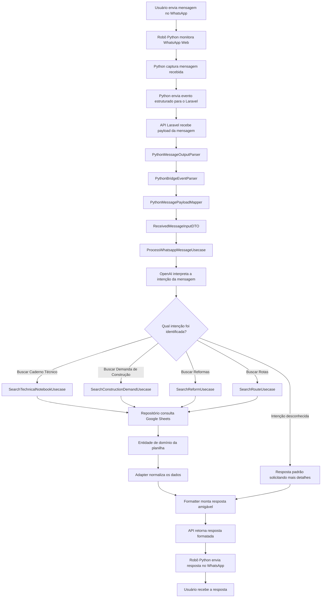

# Assistente COTEC API

API Laravel para consulta de dados da COTEC a partir de mensagens recebidas pelo WhatsApp. O projeto combina uma ponte em Python que monitora o WhatsApp Web, uma API Laravel que interpreta e processa as mensagens, integrações com OpenAI para classificação de intenção e Google Sheets como fonte de dados operacional.

## Visão geral

O assistente recebe mensagens de usuários, identifica a consulta solicitada, busca registros nas planilhas configuradas e devolve uma resposta amigável para o WhatsApp.

Principais capacidades:

- Receber payloads de mensagens pela rota `POST /api/whatsapp/messages`.
- Executar o bot de WhatsApp Web via comando Artisan `php artisan whatsapp:bridge`.
- Interpretar mensagens com regras diretas e OpenAI.
- Consultar Google Sheets por caderno técnico, demandas de construção, levantamento de terrenos e itinerários de viagem.
- Expor endpoints REST para buscas específicas em planilhas.
- Padronizar respostas no formato JSend.

## Tecnologias

- PHP 8.4 / Laravel 13
- Laravel Sanctum
- Pest 4 / PHPUnit 12
- Laravel Pint
- OpenAI PHP Laravel
- Revolution Laravel Google Sheets
- Python 3 com Selenium para automação do WhatsApp Web
- PostgreSQL
- Docker, Nginx e PHP-FPM
- Vite e Tailwind CSS 4

## Arquitetura

O projeto separa a aplicação em camadas dentro de `src/Core`:

- `Domain`: entidades, contratos de repositório, enums e resolvedores de domínio.
- `Application`: DTOs, interfaces, casos de uso, regras e serviços de aplicação.
- `Infra`: adapters, parsers, mappers, gateways para Google Sheets, integração OpenAI e ponte Python.
- `app/Http`: controllers, requests e helpers HTTP da aplicação Laravel.
- `src/Core/Infra/External/Python`: bot Python responsável por abrir o WhatsApp Web, capturar mensagens e enviar respostas.

O container de dependências é configurado em `app/Providers/AppServiceProvider.php`, ligando interfaces da camada de aplicação às implementações de infraestrutura.

Fonte do fluxograma em Mermaid:



## Endpoints

| Método | Rota | Descrição |
| --- | --- | --- |
| `GET` | `/api/google-sheet` | Lê dados de uma planilha configurada. |
| `GET` | `/api/google-sheets/{sheetId}/search` | Busca genérica por planilha. |
| `GET` | `/api/construction-demands/search` | Busca demandas de construção. |
| `GET` | `/api/land-surveys/search` | Busca levantamentos de terreno. |
| `GET` | `/api/technical-notebooks/search` | Busca cadernos técnicos. |
| `GET` | `/api/travel-itineraries/search` | Busca itinerários de viagem. |
| `POST` | `/api/whatsapp/messages` | Processa uma mensagem recebida pelo WhatsApp. |

## Configuração

Copie o arquivo de ambiente e ajuste as variáveis necessárias:

```bash
cp .env.example .env
```

Variáveis importantes:

- `APP_PORT`: porta local usada pela aplicação, padrão `4200`.
- `DB_CONNECTION`, `DB_HOST`, `DB_PORT`, `DB_DATABASE`, `DB_USERNAME`, `DB_PASSWORD`: conexão PostgreSQL.
- `OPENAI_API_KEY`: chave usada para interpretar intenções de mensagens.
- `OPENAI_ORGANIZATION` e `OPENAI_PROJECT`: opcionais, conforme configuração da conta OpenAI.
- `GOOGLE_SHEETS_COTEC_SPREADSHEET_ID`: ID da planilha principal da COTEC.
- `EDITACODIGO_API_KEY`: chave para obter seletores usados pelo bot Python.
- `WHATSAPP_URL`: URL do WhatsApp Web.
- `WHATSAPP_SESSION_FOLDER`: pasta de sessão do navegador para preservar login.

As abas conhecidas da planilha COTEC estão configuradas em `config/google_sheets.php`.

## Execução local

Instale as dependências e prepare a aplicação:

```bash
composer install
npm install
php artisan key:generate
php artisan migrate
```

Suba o ambiente de desenvolvimento:

```bash
composer run dev
```

Esse comando inicia, em paralelo, o servidor Laravel, a fila, o log com Pail e o Vite.

Para executar apenas a API:

```bash
php artisan serve --port=4200
```

## Execução com Docker

Suba os containers:

```bash
docker compose up --build
```

Serviços principais:

- `nginx`: expõe a aplicação em `http://localhost:${APP_PORT:-4200}`.
- `app`: PHP-FPM com a aplicação Laravel.
- `queue`: worker de filas Laravel.
- `db`: PostgreSQL 16.

## Bot do WhatsApp

Para iniciar a ponte entre Python e Laravel:

```bash
php artisan whatsapp:bridge
```

O comando executa `src/Core/Infra/External/Python/main.py` com saída em JSON, captura eventos do WhatsApp Web e envia comandos de resposta de volta ao processo Python.

Antes de usar, garanta que:

- O ambiente Python tenha as dependências necessárias para Selenium.
- O Chrome/driver esteja disponível no ambiente.
- A variável `EDITACODIGO_API_KEY` esteja configurada.
- A sessão do WhatsApp Web esteja autenticada ou possa ser autenticada no navegador.

## Testes e qualidade

Execute os testes:

```bash
php artisan test --compact
```

Execute um teste específico:

```bash
php artisan test --compact --filter=WhatsappMessageControllerTest
```

Formate arquivos PHP modificados:

```bash
vendor/bin/pint --dirty --format agent
```

## Estrutura de dados

A fonte principal de dados é o Google Sheets. Os gateways em `src/Core/Infra/Repository/Gateway` acessam os dados e os repositórios em `src/Core/Infra/Repository/SheetRepository` aplicam buscas específicas por campos como processo, município, força, região, situação do terreno, andamento e solicitante.

Os mappers em `src/Core/Infra/Mapper` normalizam linhas de planilha para entidades e DTOs usados pelos casos de uso. As respostas são montadas por `WhatsappMessageResponseFormatter`, limitando os primeiros resultados e orientando o usuário a refinar a busca quando houver muitos registros.
