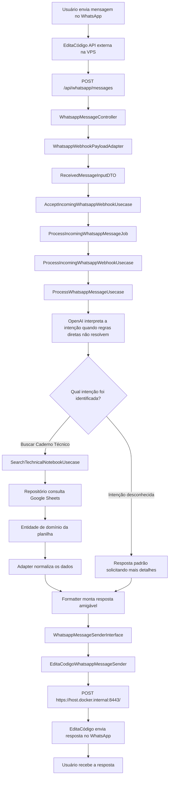

# Assistente COTEC API

API Laravel para consulta de dados da COTEC a partir de mensagens recebidas pelo WhatsApp. O fluxo padrão recebe webhooks HTTP de uma instalação externa da EditaCódigo API, interpreta e processa as mensagens no Laravel, consulta Google Sheets e envia a resposta de volta ao WhatsApp pelo endpoint local da EditaCódigo.

## Visão geral

O assistente recebe mensagens de usuários, identifica a consulta solicitada, busca registros nas planilhas configuradas e devolve uma resposta amigável para o WhatsApp.

Principais capacidades:

- Receber payloads de mensagens pela rota `POST /api/whatsapp/messages`.
- Normalizar webhooks da EditaCódigo e aliases legados para `ReceivedMessageInputDTO`.
- Enfileirar o processamento e retornar `202 Accepted` rapidamente.
- Enviar respostas ao WhatsApp via `POST {EDITACODIGO_BOT_WEBHOOK_URL}`.
- Manter o bot Python/Selenium apenas como fallback legado com `WHATSAPP_TRANSPORT=python_bridge`.
- Interpretar mensagens com regras diretas e OpenAI.
- Consultar Google Sheets por caderno técnico.
- Expor endpoints REST para buscas em planilhas.
- Padronizar respostas no formato JSend.

## Tecnologias

- PHP 8.4 / Laravel 13
- Laravel Sanctum
- Pest 4 / PHPUnit 12
- Laravel Pint
- OpenAI PHP Laravel
- Revolution Laravel Google Sheets
- Python 3 com Selenium apenas para fallback legado da ponte WhatsApp Web
- PostgreSQL
- Docker, Nginx e PHP-FPM
- Vite e Tailwind CSS 4

## Arquitetura

O projeto separa a aplicação em camadas dentro de `src/Core`:

- `Domain`: entidades, contratos de repositório, enums e resolvedores de domínio.
- `Application`: DTOs, interfaces, casos de uso, regras e serviços de aplicação.
- `Infra`: adapters, parsers, mappers, gateways para Google Sheets, integração OpenAI, sender HTTP da EditaCódigo e ponte Python legada.
- `app/Http`: controllers, requests e helpers HTTP da aplicação Laravel.
- `src/Core/Infra/External/Python`: bot Python legado, fora do caminho padrão de produção.

O container de dependências é configurado em `app/Providers/AppServiceProvider.php`, ligando interfaces da camada de aplicação às implementações de infraestrutura.

Fonte do fluxograma em Mermaid:



## Endpoints

| Método | Rota | Descrição |
| --- | --- | --- |
| `GET` | `/api/google-sheet` | Lê dados de uma planilha configurada. |
| `GET` | `/api/google-sheets/{sheetId}/search` | Busca genérica por planilha. |
| `GET` | `/api/technical-notebooks/search` | Busca cadernos técnicos. |
| `POST` | `/api/whatsapp/messages` | Aceita uma mensagem recebida pelo WhatsApp, normaliza e despacha o processamento assíncrono. |

## Configuração

Copie o arquivo de ambiente e ajuste as variáveis necessárias:

```bash
cp .env.example .env
```

Variáveis importantes:

- `APP_PORT`: porta local usada pela aplicação, padrão `4200`.
- `DB_CONNECTION`, `DB_HOST`, `DB_PORT`, `DB_DATABASE`, `DB_USERNAME`, `DB_PASSWORD`: conexão PostgreSQL.
- `OPENAI_API_KEY`: chave usada para interpretar intenções de mensagens.
- `OPENAI_ORGANIZATION` e `OPENAI_PROJECT`: opcionais, conforme configuração da conta OpenAI.
- `GOOGLE_SHEETS_COTEC_SPREADSHEET_ID`: ID da planilha principal da COTEC.
- `WHATSAPP_TRANSPORT`: transporte de WhatsApp. O padrão é `editacodigo_http`; `python_bridge` é fallback legado.
- `EDITACODIGO_BOT_WEBHOOK_URL`: endpoint local do bot EditaCódigo para envio de respostas, padrão `https://host.docker.internal:8443/`.
- `EDITACODIGO_BOT_USER`: usuário configurado no bot EditaCódigo.
- `EDITACODIGO_BOT_TOKEN`: token configurado no bot EditaCódigo.
- `EDITACODIGO_BOT_TIMEOUT`: timeout da chamada HTTP de envio.
- `EDITACODIGO_BOT_RETRY_TIMES`: tentativas da chamada HTTP de envio.
- `EDITACODIGO_BOT_VERIFY_TLS`: validação TLS do endpoint de envio. Use `false` quando a EditaCódigo local usar certificado self-signed em `host.docker.internal`.
- `EDITACODIGO_API_URL` e `EDITACODIGO_API_KEY`: API de licenciamento/carregamento da EditaCódigo. Não confunda com `EDITACODIGO_BOT_WEBHOOK_URL`.
- `WHATSAPP_URL` e `WHATSAPP_SESSION_FOLDER`: usados apenas pelo fallback Python/Selenium legado.

As abas conhecidas da planilha COTEC estão configuradas em `config/google_sheets.php`.

## Execução local

Instale as dependências e prepare a aplicação:

```bash
composer install
npm install
php artisan key:generate
php artisan migrate
```

Suba o ambiente de desenvolvimento:

```bash
composer run dev
```

Esse comando inicia, em paralelo, o servidor Laravel, a fila, o log com Pail e o Vite.

Para executar apenas a API:

```bash
php artisan serve --port=4200
```

## Execução com Docker

Suba os containers:

```bash
docker compose up --build
```

Serviços principais:

- `nginx`: expõe a aplicação em `http://localhost:${APP_PORT:-4200}`.
- `app`: PHP-FPM com a aplicação Laravel.
- `queue`: worker de filas Laravel.
- `db`: PostgreSQL 16.

Os serviços `app` e `queue` possuem `extra_hosts` para resolver `host.docker.internal`, usado pelo Laravel dentro do Docker para acessar a EditaCódigo API executada diretamente na VPS.

## WhatsApp e EditaCódigo

No fluxo padrão, a EditaCódigo API externa envia mensagens para:

```text
POST http://127.0.0.1:4200/api/whatsapp/messages
```

A aplicação Laravel processa a mensagem em fila e envia a resposta para:

```text
POST https://host.docker.internal:8443/
```

Exemplo de webhook de entrada:

```bash
curl -X POST http://127.0.0.1:4200/api/whatsapp/messages \
  -H "Content-Type: application/json" \
  -d '{
    "customer_contact": "5571999999999",
    "content": "Olá",
    "external_id": "teste-integracao-001",
    "source": "editacodigo"
  }'
```

Resposta esperada da API Laravel:

```json
{
  "status": "success",
  "data": {
    "accepted": true,
    "external_id": "teste-integracao-001",
    "duplicate": false
  }
}
```

Payload enviado pelo Laravel para a EditaCódigo:

```json
{
  "usuario": "editacodigo_user",
  "token": "",
  "action": "EnviarMsg",
  "message": {
    "telefone": "5571999999999",
    "msg": "Resposta gerada pelo assistente",
    "id_msg": "teste-integracao-001"
  }
}
```

## Ponte Python Legada

O comando abaixo não deve ser usado no fluxo novo da VPS. Ele só inicia o fallback Python/Selenium quando `WHATSAPP_TRANSPORT=python_bridge`:

```bash
php artisan whatsapp:bridge
```

Quando o transporte está em `editacodigo_http`, o comando retorna sem iniciar `src/Core/Infra/External/Python/main.py`, Chrome ou Selenium.

Antes de usar o fallback legado, garanta que:

- O ambiente Python tenha as dependências necessárias para Selenium.
- O Chrome/driver esteja disponível no ambiente.
- A variável `EDITACODIGO_API_KEY` esteja configurada.
- A sessão do WhatsApp Web esteja autenticada ou possa ser autenticada no navegador.

## Testes e qualidade

Execute os testes:

```bash
php artisan test --compact
```

Execute um teste específico:

```bash
php artisan test --compact tests/Feature/App/Http/Controllers/WhatsappMessageControllerTest.php
```

Formate arquivos PHP modificados:

```bash
vendor/bin/pint --dirty --format agent
```

## Estrutura de dados

A fonte principal de dados é o Google Sheets. Os gateways em `src/Core/Infra/Repository/Gateway` acessam os dados e o repositório em `src/Core/Infra/Repository/SheetRepository` aplica buscas específicas por campos como processo, município, força e região.

Os mappers em `src/Core/Infra/Mapper` normalizam linhas de planilha para entidades e DTOs usados pelos casos de uso. As respostas são montadas por `WhatsappMessageResponseFormatter`, limitando os primeiros resultados e orientando o usuário a refinar a busca quando houver muitos registros.
